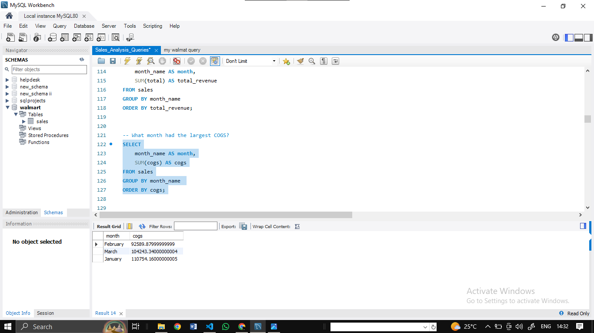

# Sale-Analysis-in-SQL

# Walmart Sales Data Analysis

## About

This project aims to explore the Walmart Sales data to understand top performing branches and products, sales trend of of different products, customer behaviour. The aims is to study how sales strategies can be improved and optimized.

## Purposes Of The Project

The major aim of thie project is to gain insight into the sales data of Walmart to understand the different factors that affect sales of the different branches.

## About Data

The data contains 17 columns and 1000 rows:

| Column                  | Description                             | Data Type      |
| :---------------------- | :-------------------------------------- | :------------- |
| invoice_id              | Invoice of the sales made               | VARCHAR(30)    |
| branch                  | Branch at which sales were made         | VARCHAR(5)     |
| city                    | The location of the branch              | VARCHAR(30)    |
| customer_type           | The type of the customer                | VARCHAR(30)    |
| gender                  | Gender of the customer making purchase  | VARCHAR(10)    |
| product_line            | Product line of the product solf        | VARCHAR(100)   |
| unit_price              | The price of each product               | DECIMAL(10, 2) |
| quantity                | The amount of the product sold          | INT            |
| VAT                 | The amount of tax on the purchase       | FLOAT(6, 4)    |
| total                   | The total cost of the purchase          | DECIMAL(10, 2) |
| date                    | The date on which the purchase was made | DATE           |
| time                    | The time at which the purchase was made | TIMESTAMP      |
| payment_method                 | The total amount paid                   | DECIMAL(10, 2) |
| cogs                    | Cost Of Goods sold                      | DECIMAL(10, 2) |
| gross_margin_percentage | Gross margin percentage                 | FLOAT(11, 9)   |
| gross_income            | Gross Income                            | DECIMAL(10, 2) |
| rating                  | Rating                                  | FLOAT(2, 1)    |

### Analysis List

1. Product Analysis

> Conduct analysis on the data to understand the different product lines, the products lines performing best and the product lines that need to be improved.

2. Sales Analysis

> This analysis aims to answer the question of the sales trends of product. The result of this can help use measure the effectiveness of each sales strategy the business applies and what modificatoins are needed to gain more sales.

3. Customer Analysis

> This analysis aims to uncover the different customers segments, purchase trends and the profitability of each customer segment.

## Approach Used

1. **Data Wrangling:** This is the first step where inspection of data is done to make sure **NULL** values and missing values are detected and data replacement methods are used to replace, missing or **NULL** values.

> 1. Build a database
> 2. Create table and insert the data.
> 3. Select columns with null values in them. There are no null values in our database as in creating the tables, we set **NOT NULL** for each field, hence null values are filtered out.

2. **Feature Engineering:** This will help use generate some new columns from existing ones.

> 1. Add a new column named `time_of_day` to give insight of sales in the Morning, Afternoon and Evening. This will help answer the question on which part of the day most sales are made.

> 2. Add a new column named `day_name` that contains the extracted days of the week on which the given transaction took place (Mon, Tue, Wed, Thur, Fri). This will help answer the question on which week of the day each branch is busiest.

> 3. Add a new column named `month_name` that contains the extracted months of the year on which the given transaction took place (Jan, Feb, Mar). Help determine which month of the year has the most sales and profit.

2. **Exploratory Data Analysis (EDA):** Exploratory data analysis is done to answer the listed questions and aims of this project.

3. **Conclusion:**

## Business Questions To Answer

### Generic Question

1. How many unique cities does the data have?

```SQL
-- How many unique cities does the data have?
SELECT 
	DISTINCT city
FROM sales;
```


2. In which city is each branch?
```SQL
SELECT 
	DISTINCT city,
    branch
FROM sales;
```

### Product

3. How many unique product lines does the data have?
```SQL
SELECT
	DISTINCT product_line
FROM sales;
```


4. What is the most selling product line?
```SQL
SELECT
	SUM(quantity) as qty,
    product_line
FROM sales
GROUP BY product_line
ORDER BY qty DESC;SELECT
	SUM(quantity) as qty,
    product_line
FROM sales
GROUP BY product_line
ORDER BY qty DESC;

```


5. What is the total revenue by month?
```sql
SELECT
	month_name AS month,
	SUM(total) AS total_revenue
FROM sales
GROUP BY month_name 
ORDER BY total_revenue;
```


6. What month had the largest COGS?
```sql
SELECT
	month_name AS month,
	SUM(cogs) AS cogs
FROM sales
GROUP BY month_name 
ORDER BY cogs;
```


7. What product line had the largest revenue?
```sql
SELECT
	product_line,
	SUM(total) as total_revenue
FROM sales
GROUP BY product_line
ORDER BY total_revenue DESC;
```


8. What is the city with the largest revenue?
```sql
SELECT
	branch,
	city,
	SUM(total) AS total_revenue
FROM sales
GROUP BY city, branch 
ORDER BY total_revenue;

```


9. What product line had the largest VAT?
```sql
SELECT
	product_line,
	AVG(tax_pct) as avg_tax
FROM sales
GROUP BY product_line
ORDER BY avg_tax DESC;
```


10. Fetch each product line and add a column to those product line showing "Good", "Bad". Good if its greater than average sales
```sql
-- Fetch each product line and add a column to those product 
-- line showing "Good", "Bad". Good if its greater than average sales

SELECT 
	AVG(quantity) AS avg_qnty
FROM sales;

SELECT
	product_line,
	CASE
		WHEN AVG(quantity) > 6 THEN "Good"
        ELSE "Bad"
    END AS remark
FROM sales
GROUP BY product_line;
```


11. Which branch sold more products than average product sold?
```sql
SELECT 
	branch, 
    SUM(quantity) AS qnty
FROM sales
GROUP BY branch
HAVING SUM(quantity) > (SELECT AVG(quantity) FROM sales);
```


12. What is the most common product line by gender?
```sql
-- What is the most common product line by gender
SELECT
	gender,
    product_line,
    COUNT(gender) AS total_cnt
FROM sales
GROUP BY gender, product_line
ORDER BY total_cnt DESC;
```


13. What is the average rating of each product line?
```sql
-- What is the average rating of each product line
SELECT
	ROUND(AVG(rating), 2) as avg_rating,
    product_line
FROM sales
GROUP BY product_line
ORDER BY avg_rating DESC;
```


### Sales

1. Number of sales made in each time of the day per weekday
```sql
-- Number of sales made in each time of the day per weekday 
SELECT
	time_of_day,
	COUNT(*) AS total_sales
FROM sales
WHERE day_name = "Sunday"
GROUP BY time_of_day 
ORDER BY total_sales DESC;
-- Evenings experience most sales, the stores are 
-- filled during the evening hours
```


2. Which of the customer types brings the most revenue?
```sql
-- Which of the customer types brings the most revenue?
SELECT
	customer_type,
	SUM(total) AS total_revenue
FROM sales
GROUP BY customer_type
ORDER BY total_revenue;
```


3. Which city has the largest tax percent/ VAT (**Value Added Tax**)?
```sql
-- Which city has the largest tax/VAT percent?
SELECT
	city,
    ROUND(AVG(tax_pct), 2) AS avg_tax_pct
FROM sales
GROUP BY city 
ORDER BY avg_tax_pct DESC;
```


4. Which customer type pays the most in VAT?
```sql
-- Which customer type pays the most in VAT?
SELECT
	customer_type,
	AVG(tax_pct) AS total_tax
FROM sales
GROUP BY customer_type
ORDER BY total_tax;
```


### Customer

1. How many unique customer types does the data have?
```sql
SELECT
	DISTINCT customer_type
FROM sales;
```


2. How many unique payment methods does the data have?
```sql
-- How many unique payment methods does the data have?
SELECT
	DISTINCT payment_method
FROM sales;
```


3. What is the most common customer type?
```sql
-- What is the most common customer type?
SELECT
	customer_type,
	count(*) as count
FROM sales
GROUP BY customer_type
ORDER BY count DESC;
```


4. Which customer type buys the most?
```
-- Which customer type buys the most?
SELECT
	customer_type,
    COUNT(*)
FROM sales
GROUP BY customer_type;
```


5. What is the gender of most of the customers?
```sql
-- What is the gender of most of the customers?
SELECT
	gender,
	COUNT(*) as gender_cnt
FROM sales
GROUP BY gender
ORDER BY gender_cnt DESC;
```

6. What is the gender distribution per branch?
```sql
-- What is the gender distribution per branch?
SELECT
	gender,
	COUNT(*) as gender_cnt
FROM sales
WHERE branch = "C"
GROUP BY gender
ORDER BY gender_cnt DESC;
-- Gender per branch is more or less the same hence, I don't think has
-- an effect of the sales per branch and other factors.

```


7. Which time of the day do customers give most ratings?
```sql
-- Which time of the day do customers give most ratings?
SELECT
	time_of_day,
	AVG(rating) AS avg_rating
FROM sales
GROUP BY time_of_day
ORDER BY avg_rating DESC;
-- Looks like time of the day does not really affect the rating, its
-- more or less the same rating each time of the day.
```


8. Which time of the day do customers give most ratings per branch?
```sql

-- Which time of the day do customers give most ratings per branch?
SELECT
	time_of_day,
	AVG(rating) AS avg_rating
FROM sales
WHERE branch = "A"
GROUP BY time_of_day
ORDER BY avg_rating DESC;
-- Branch A and C are doing well in ratings, branch B needs to do a 
-- little more to get better ratings.
```
9. Which day fo the week has the best avg ratings?
```sql
-- Which day of the week has the best average ratings per branch?
SELECT 
	day_name,
	COUNT(day_name) total_sales
FROM sales
WHERE branch = "C"
GROUP BY day_name
ORDER BY total_sales DESC;

```


## Revenue And Profit Calculations

$ COGS = unitsPrice * quantity $

$ VAT = 5\% * COGS $

$VAT$ is added to the $COGS$ and this is what is billed to the customer.

$ total(gross_sales) = VAT + COGS $

$ grossProfit(grossIncome) = total(gross_sales) - COGS $

**Gross Margin** is gross profit expressed in percentage of the total(gross profit/revenue)

$ \text{Gross Margin} = \frac{\text{gross income}}{\text{total revenue}} $

<u>**Example with the first row in our DB:**</u>

**Data given:**

- $ \text{Unite Price} = 45.79 $
- $ \text{Quantity} = 7 $

$ COGS = 45.79 * 7 = 320.53 $

$ \text{VAT} = 5\% * COGS\\= 5\%  320.53 = 16.0265 $

$ total = VAT + COGS\\= 16.0265 + 320.53 = $336.5565$

$ \text{Gross Margin Percentage} = \frac{\text{gross income}}{\text{total revenue}}\\=\frac{16.0265}{336.5565} = 0.047619\\\approx 4.7619\% $


